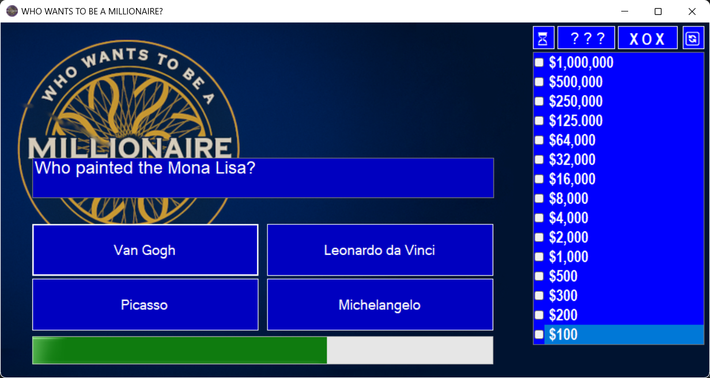
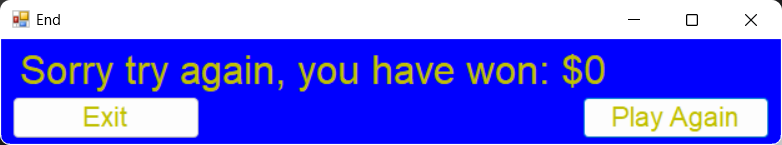
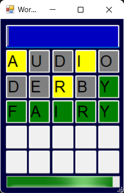
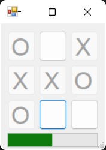

# Кој сака да биде милионер?

## Проект по предметот Визуелно Програмирање на ФИНКИ изработен од: Христијан Павлов (236055)

## Објаснување на проблемот

Проектот претставува имплементација на квизот „Кој сака да биде милионер?“, со измени во џокерите на играте. 
Новите џокери во играта се:
- [Wordle](#wordle)
- [CodeBreaker](#codebreaker)
- [TicTacToe](#tictactoe)
- [Question Swap](#question-swap)

Прашањата на квизот се добиени со користење на ChatGPT GPT-4o преку следниот prompt:

    Generate 100 general knowledge quiz questions in this exact format:
    "[Question text]?:[AnswerA],[1 or 0];[AnswerB],[1 or 0];[AnswerC],[1 or 0];[AnswerD],[1 or 0];"
    Only one answer should be correct(marked with,1), and the others incorrect(marked with,0).
    Return it as a JSON list of strings.

Одговорот на барањето е зачувано во JSON датотека од која се избираат 16 прашања, 15 за квизот и 1 за Question Swap џокерот.
Откако ќе се изберат прашањата од нив се креираат објекти од класата Question кои се додаваат во листа.

### Wordle
Овој џокер е базиран на популарната игра Wordle и треба да се погоди збор од пет букви.
За добивање на зборовите исто така е користено ChatGPT GPT-4o. 
За влез се користи тастатура и играчот добива повратна информација така што се испишува нивниот збор и позадината на буквата се обојува во:
- зелена - доколку буквата е на точна позиција;
- жолта - доколку буквата се содржи во зборот;
- сива - доколку буквата не се содржи во зборот.

Доколку играчот го погоди зборот во даденото време тој го прескокнува прашањето, во спротинво играта завршува.

### CodeBreaker
Во овој џокер играчот треба да внесе број кои ги задоволува зададените барања.
Барањата се добиваат со користење на Random кластата преку која добиваме вредности кои подоцна ги користиме за задавање на барањата.
Доколку играчот внеси број кои ги задоволува барањата прашањето се прескокнува, во спротинво играта завршува.

### TicTacToe
Во овој џокер играчот игра X-0 против противник кои користи Expectimax алгоритам за избирање на следниот потег.
Доколку играчот победи или е нерешено тогаш прашањето се прескокнува, во спротивно играта завршува.

### Question Swap
Во овој џокер прањањето се заменува со друго прашање на кое играчот треба да одговори.

## Изглед на апликацијата

